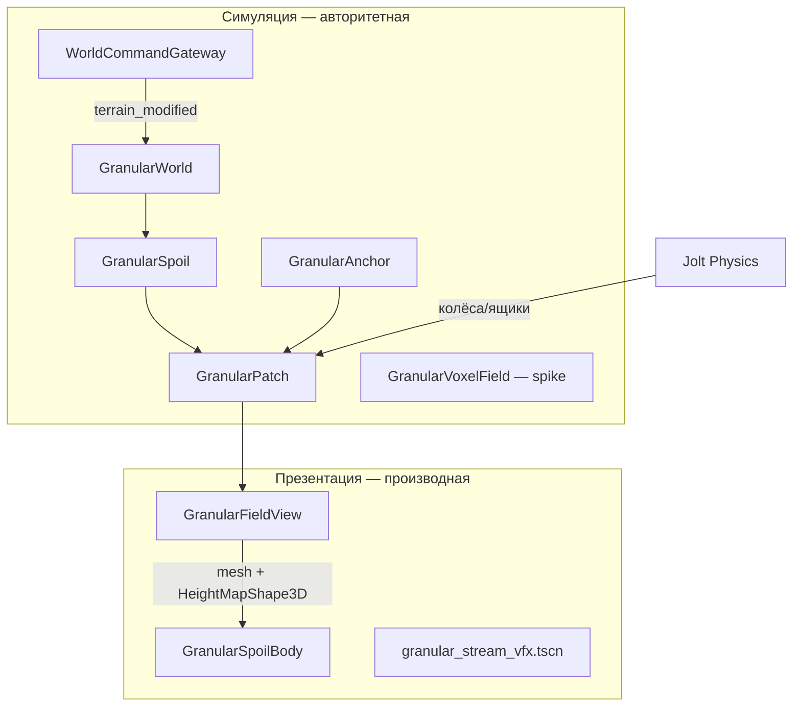

# Отчёт: granular/regolith в Regolith и аналоги

## 1. Текущая реализация Regolith

### Контракт и документация

Granular v0 описан в `Y:/regolith/docs/specs/GRANULAR-V0.md`. В индексе `PHYSICAL-LANGUAGE.md` **нет отдельной строки** для granular/spoil — термины живут только в спеке. Реголит как **скальный SDF** и как **рыхлый слой** разделены явно:

| Истина | Где | Мутация |
|---|---|---|
| Скала | Voxel SDF (Voxel Tools) | `terrain_carve` через `WorldCommandGateway` |
| Рыхлое | `GranularPatch` (толщина на клетку) | `deposit` / `take` / `relax` / `settle_load` |
| «Зёрна» | VFX + mesh grain | только презентация |

SDF **не хранит количество** материала — релаксация SDF дала бы эрозию, а не перенос массы. Поэтому рыхлое — отдельный слой.

### Архитектура: симуляция vs презентация



**Симуляция (RefCounted, без Node):**

- **`GranularPatch`** (`Y:/regolith/scripts/simulation/runtime/granular_patch.gd`, ~760 строк) — локальное height-field: на клетку `base`, `thickness`, `blocked`, `ceiling`, `_flowing`. Ключевое:
  - Релаксация к углу естественного откоса ~33° (8 соседей, double buffer, детерминизм без RNG)
  - **Гистерезис**: угол максимальной устойчивости vs угол покоя (`mobilize` → лавина)
  - **Несущая способность**: Bekker-подобная `penetration_depth_m` + `settle_load` + `imprint_disc`
  - `spill_edge` — просыпание через открытые края (явная маршрутизация между патчами)
  - `advance(delta, gravity)` — скорость осыпания ∝ √(g/cell) (лунная гравитация 1.62 м/с²)

- **`GranularAnchor`** (`Y:/regolith/scripts/simulation/runtime/granular_anchor.gd`) — касательная плоскость на планетоиде: radial `up`, round-trip world ↔ patch-local метры.

- **`GranularSpoil`** (`Y:/regolith/scripts/simulation/runtime/granular_spoil.gd`) — мост dig→spoil:
  - `SWELL_FACTOR = 1.0` (разрыхление отключено)
  - `VISIBLE_FRACTION = 0.5` (половина выемки видна как куча)
  - `deposit_ring` / `deposit_heap` — кольцо вокруг устья vs точечная насыпь

**Презентация (Node3D):**

- **`GranularFieldView`** (`Y:/regolith/scripts/presentation/granular_field_view.gd`) — меш из thickness + визуальный grain; **коллайдер читает поле напрямую**, не сглаженный меш; `refresh()` — критически затухающий фильтр (~10 Hz settle rate vs 60 FPS).

- **`GranularSpoilBody`** (`Y:/regolith/scripts/presentation/granular_spoil_body.gd`) — `StaticBody3D` в группе `granular_spoil`; duck-typing для `InteractionHit.KIND_GRANULAR`, чтобы бур работал по куче.

**Интеграция в мир:**

- **`GranularWorld`** (`Y:/regolith/scripts/granular_world.gd`) — слушает `terrain_modified`, лениво создаёт патчи 32×32×0.25 м (8 м), до 6 штук, raycast базы из SDF, `deposit_heap` с downhill bias.
- **Статус: ОТКЛЮЧЕНО** — в `Y:/regolith/scenes/main.tscn`: `GranularWorld enabled = false`.
- В шапке файла — развёрнутое объяснение, почему height-field **не подходит** для открытого sandbox на планетоиде: seam с Transvoxel, невозможность стен/тоннелей, overlapping patches без общей истины, «висящие» кучи при undermining с соседнего патча.

**Dig pipeline:**

```12:29:Y:/regolith/scripts/world_command_gateway.gd
// terrain carve → _notify_terrain_modified → GranularWorld (если enabled)
// granular hit → _remove_granular → GranularWorld.dig_spoil → yield в store
```

`tool_controller.gd` принимает `KIND_GRANULAR` наряду с voxel.

### Демо-сцены (глаз, не тесты)

| Сцена | Назначение |
|---|---|
| `scenes/granular_playground.tscn` | Отвал, ящики, усадка, mobilize — **patch владеет полом** |
| `scenes/granular_cascade.tscn` | Два патча, spill с полки на пол + stream VFX |
| `scenes/bench_granular_voxel_ca.tscn` | Spike производительности `GranularVoxelField` |

### Новое направление: объёмный CA

**`GranularVoxelField`** (`Y:/regolith/scripts/simulation/runtime/granular_voxel_field.gd`) — 3D сетка с fill fraction 0..1, active list, fall + spread (8 diagonal-down соседей). Решает проблемы height-field: тоннели, стены, слияние куч.

**`bench_granular_voxel_ca.gd`** — бенч 96×64×96 @ 0.25 м (~590k ячеек), порог 4 ms/sweep, проверка объёма и формы конуса.

### Тесты

**`test_granular_patch.gd`** — 30 тестов (в `tests/run_tests.sh` как `test_granular_patch`):

- Сохранение объёма, угол откоса, не-diamond pile (8 vs 4 соседа)
- Лунная vs земная скорость осыпания (√(g))
- Метastable slope + mobilize → лавина
- Ceiling под телом, bearing/settle_load, imprint+rim
- Spill между патчами, anchor на планетоиде
- Spoil ring/heap, `min_presence_m` → дыры в коллайдере

Спека явно: **ощущение сыпучести — только в игре**, не headless.

---

## 2. Пробелы vs state of the art

| Область | Regolith v0 | State of the art |
|---|---|---|
| **Физика зёрен** | Height-field CA + упрощённая несущая способность | DEM (Chrono DEM-Engine, GranularGym): тысячи–миллионы частиц, форма зёрен GRC-1 |
| **Terramechanics** | Linear p–z, угол откоса | Chrono CRM (SPH continuum), Bekker–Wong/Janosi для колёс и лugs |
| **Геометрия рыхлого** | Single-valued height field (ограничение) | 3D volume (Regolith уже начал `GranularVoxelField`) или DEM |
| **Интеграция с terrain** | Отключена из‑за seam/overlap | Единый voxel volume (второй VoxelTerrain) или embedded particles |
| **Массовый баланс dig** | 50% visible, swell=1 | Разрыхление 10–25%, haul-away, обратный путь рыхлое→SDF |
| **Фракции** | Один `density_scale` | Fines/blocky, сегрегация, ярусы отвала |
| **Персистентность** | Нет (патчи не в сейве) | Chunk streaming + save |
| **Колёса/гусеницы** | HeightMap + grip Surface | Sinkage, bulldozing, rut formation |
| **Кооп/реплей** | Детерминизм CA ✓ | ✓ (сильная сторона Regolith) |
| **VFX** | Декларативный stream + mesh grain | Частицы + dust plume при низкой g |

**Главный structural gap:** height-field **работает в playground**, но **провалился в интеграции** с voxel planetoid — команда уже зафиксировала это в комментариях `granular_world.gd` и движется к volume CA + voxel plugin meshing/collision.

**Контрактный gap:** `PHYSICAL-LANGUAGE.md` § Impact Destruction всё ещё говорит «кинетически вырезанный грунт исчезает» — granular v0 это частично меняет, но только для буров при включённом `GranularWorld`.

---

## 3. Похожие open-source проекты (web)

### Godot / lunar / digging

| Проект | URL | Релевантность |
|---|---|---|
| **LunCo** | [github.com/LunCoSim/lunco-sim-godot](https://github.com/LunCoSim/lunco-sim-godot) | Godot 4, лунные миссии, rovers, digital twin; solver-based physics (не granular CA) |
| **LUMINSim** | [aurorarobotics.sssn.us/LUMINSim](https://aurorarobotics.sssn.us/index.php/LUMINSim) | Godot 4.4, лунный robotics/mining simulator (alpha, Steam roadmap) |
| **Zylann godot_voxel** | [github.com/Zylann/godot_voxel](https://github.com/Zylann/godot_voxel) | Realtime voxel edit — **основа terrain Regolith**; digging без loose spoil |
| **solar_system_demo** | [github.com/Zylann/solar_system_demo](https://github.com/Zylann/solar_system_demo) | Planetoid + editable voxels — ближайший Godot-аналог масштаба |
| **SpaceExcavation** | [github.com/YoAMIOT/SpaceExcavation](https://github.com/YoAMIOT/SpaceExcavation) | Godot prototype космической excavación |
| **Syntaxxor / JorisAR voxel** | GDExtension SDF terrain | Альтернативы meshing, без granular |

### Granular / regolith (research-grade, не Godot)

| Проект | URL | Релевантность |
|---|---|---|
| **Project Chrono + DEM-Engine** | [github.com/Hiroyuki-Hashimoto/DEM-Engine](https://github.com/Hiroyuki-Hashimoto/DEM-Engine) | GPU DEM, lunar simulant GRC-1, RASSOR digging |
| **Chrono CRM** | [arxiv.org/html/2507.05643v1](https://arxiv.org/html/2507.05643v1) | Continuum terramechanics, 100M SPH particles, open source |
| **GranularGym** | [github.com/dmillard/GranularGym](https://github.com/dmillard/GranularGym) | Realtime hundreds of k particles + rigid bodies (NASA fellowship) |

### Voxel + falling sand (game feel)

| Проект | URL | Релевантность |
|---|---|---|
| **n3d2** | [github.com/dfayd0/n3d2](https://github.com/dfayd0/n3d2) | Bevy, 0.25 m voxels, 20 Hz sand CA, dig under sand — **ближайший game design reference** |
| **sandspiel** | [github.com/MaxBittker/sandspiel](https://github.com/MaxBittker/sandspiel) | 2D CA эталон «feel» |
| **3DCellularWorld** | [github.com/ccrock4t/3DCellularWorld](https://github.com/ccrock3DCellularWorld) | 3D falling sand CA, conservative matter |

**Вывод по landscape:** в Godot **нет** зрелого open-source lunar regolith с mass-conserving spoil. Regolith уникален попыткой детерминированного CA + planetoid anchor; LunCo/LUMINSim — rovers/mission, не сыпучий отвал; n3d2/Chrono — лучшие референсы по physics feel.

---

## 4. Конкретные next steps для «great» granular simulation

### Фаза A — завершить pivot на volume (критично)

1. **Довести `GranularVoxelField` до parity с `GranularPatch`:**
   - Портировать гистерезис (stability vs repose), mobilize, bearing/settle
   - Radial «down» вместо `-Y` (chunk-local gravity from `GravityField`)
   - Chunking (8–16 m chunks, LRU как у патчей)

2. **Второй VoxelTerrain / VoxelLodTerrain для loose layer:**
   - Канал density или отдельный generator из `GranularVoxelField`
   - Общий collider через Voxel Tools (без HeightMap seam)
   - Spike `bench_granular_voxel_ca` → CI gate (как `test_granular_patch`)

3. **Переподключить dig→spoil на volume path:**
   - `terrain_modified` → deposit в voxel chunk at mouth (heap, не sheet — уже выученный урок)
   - `_remove_granular` → `take` из voxel field
   - Включить в `main.tscn` только после visual QA

### Фаза B — game feel и баланс

4. **Калибровка массы:** включить `SWELL_FACTOR` > 1, tune `VISIBLE_FRACTION`, связать с `TERRAIN-MATERIALS-V1` (mare vs highland → разный repose/density).

5. **Haul-away loop:** scoop → rover bed / processor — иначе кучи неизбежно закапывают working face.

6. **Wheel–soil:** читать `surface_height_at_m` / voxel density под контактом; sinkage + bulldozing rim (уже есть `imprint_disc` как прототип).

7. **Undermining / cave-in:** mobilize + spill между chunks; тест «копка под кучей роняет её».

### Фаза C — контракт и polish

8. **Обновить `PHYSICAL-LANGUAGE.md`:** строка в индексе → § Granular/Spoil; согласовать с § Impact Destruction (spoil vs vanish).

9. **Персистентность:** сериализация chunk mass в moon save (SQLite digs уже есть — расширить).

10. **VFX:** `granular_stream_vfx.tscn` при deposit/spill; low-g dust hang time; привязка к `flowing_volume_m3`.

11. **Presets материалов:** уже в playground (`fines`, `blocky spoil`) — вынести в `moon_terrain_params` / balance JSON.

### Фаза D — амбициозно (если нужен research tier)

12. **Hybrid:** coarse voxel CA для bulk + декоративные DEM particles на surface (не truth) — как компромисс с GranularGym без GPU solver в Godot.

13. **Benchmark vs Apollo/Surveyor:** sanity bounds уже в спеке (cm при kPa) — автоматический regression test.

---

### Краткий вердикт

Regolith уже имеет **сильное, хорошо протестированное ядро** height-field CA (`GranularPatch` + 30 тестов) и продуманную архитектуру sim/pres separation. **Production integration сознательно приостановлена** — height-field не масштабируется на планетоидный voxel sandbox. Стратегически правильный следующий шаг — **`GranularVoxelField` + voxel plugin**, перенося физические правила из patch, а не дорабатывать `GranularWorld` height-field дальше. Для «great» нужны: volume integration, mass balance с haul-away, wheel coupling и persist — не DEM на GPU (это другой продукт).

[REDACTED]
