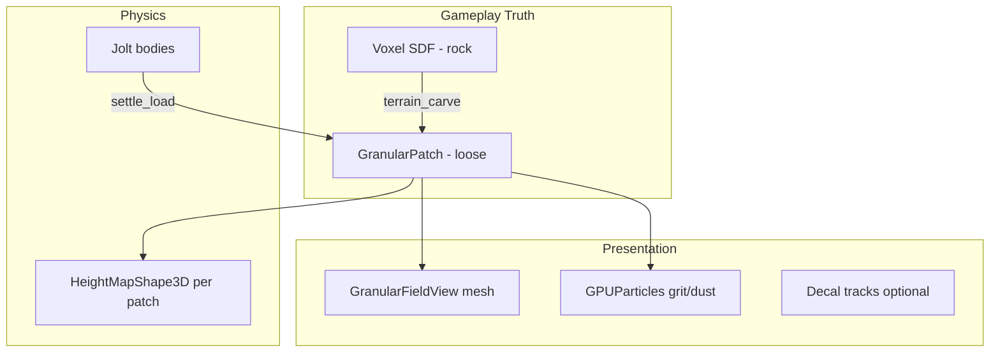

# UE5: жидкости, гранулы, грунт и разрушение — обзор и сравнение с Godot

## Резюме

Unreal Engine 5 даёт **многоуровневый стек**: GPU-симуляции (Niagara), rigid-body разрушение (Chaos), heightmap-ландшафт с плагинами runtime-редактирования, визуальные «отпечатки» через Virtual Heightfield Mesh (VHM) + Runtime Virtual Textures (RVT), отдельные voxel-плагины для настоящего копания. **Единой «системы почвы» из коробки нет** — AAA-симуляции (SnowRunner, MudRunner) строятся на **собственных CPU/GPU пайплайнах**, часто с разделением physics и rendering.

Для indie/Godot переносимы не «весь Niagara», а **архитектурные паттерны**: layered truth (твёрдое + рыхлое), spatial hash, angle-of-repose relaxation, decal/VFX как презентация, heightfield overlay вместо полной деформации коллизии.

---

## 1. Niagara: жидкости и гранулярные частицы

### Niagara Fluids (официально, Beta)

Встроенный плагин **Niagara Fluids** — grid-based симуляции на Simulation Stages + Grid Collection:

| Шаблон | Назначение |
|---|---|
| Gas | дым, огонь, облака |
| FLIP | 3D жидкость |
| Shallow Water | реки, лужи, мелководье |

- Документация: [Fluid Simulation in Unreal Engine](https://dev.epicgames.com/documentation/en-us/unreal-engine/fluid-simulation-in-unreal-engine)
- Туториал: [Welcome to Niagara Fluids](https://dev.epicgames.com/community/learning/tutorials/orJv/welcome-to-niagara-fluids)
- Data Channels (источники из любого Niagara): [Source Into Fluids From Any Niagara System](https://dev.epicgames.com/community/learning/tutorials/7JDb/unreal-engine-source-into-fluids-from-any-niagara-system-data-channels)

**Важно:** это в основном **VFX-симуляция**, не gameplay-authoritative физика грунта. Статус Beta — осторожно в shipping.

### Гранулы / «песок» / SPH в Niagara

Niagara — по сути **GPU compute framework**, не только спрайты:

| Техника | Применение |
|---|---|
| **Position Based Dynamics (PBD)** | твёрдоподобные зёрна, попкорн («The Kernel» в UE5 demo) |
| **Neighbor Grid 3D** | O(n) вместо O(n²) для particle-particle |
| **Simulation Stages + Grid2D** | falling sand, reaction-diffusion, cellular automata |
| **SPH + Screen Space Fluid** | жидкость из частиц (community) |

**Ресурсы:**
- Inside Unreal: [Advanced Niagara Effects](https://www.youtube.com/watch?v=31GXFW-MgQk) — PBD, spatial hash, neighbor grid, world interfaces
- Блог: [Niagara VFX Beyond Particles (StraySpark)](https://www.strayspark.studio/blog/niagara-vfx-advanced-simulation-stages)
- GitHub MIT: [UE5-NiagaraSPH](https://github.com/CheapMeow/UE5-NiagaraSPH) — SPH + Neighbor Grid 3D + screen-space fluid rendering
- VR-практика: [Niagara Collisions & Landscape Deformation (The Rookies)](https://www.therookies.co/blog/breakdowns/real-time-projects-niagara-collisions-landscape-deformation-more)

**Ограничения для gameplay:** частицы Niagara не дают persistent terrain edit, не синхронизируются с Landscape collision «из коробки». Нужен readback в heightmap/voxel или отдельный gameplay-слой.

---

## 2. Chaos Physics: debris и разрушение

**Chaos Destruction** — pre-fractured rigid bodies, не granular soil:

- [Chaos Destruction in Unreal Engine](https://dev.epicgames.com/documentation/en-us/unreal-engine/chaos-destruction-in-unreal-engine)
- [Destruction Overview](https://dev.epicgames.com/documentation/en-us/unreal-engine/destruction-overview)
- Туториалы: [Fracture and Clustering](https://dev.epicgames.com/community/learning/tutorials/k84m/unreal-engine-chaos-destruction-fracture-and-clustering), [Geometry Collections](https://dev.epicgames.com/community/learning/tutorials/yrXz/unreal-engine-chaos-destruction-geometry-collections)

**Ключевые концепции:**
- **Geometry Collection** — контейнер fractured mesh + simulation props
- **Fracture Mode** — uniform/cluster/planar/slice
- **Clustering** — иерархия: сначала крупные куски, потом мелкие (performance)
- **Physics Fields** — ослабление/триггер разрушения
- **Chaos Cache** — bake симуляции для cinematic/performance

**Для грунта/копания:** Chaos хорош для **обломков породы, бетона, льда** после удара. Не заменяет volume-conserving spoil heap. Переносимо в Godot: pre-fractured `RigidBody3D` clusters + cached playback — аналог Regolith `IMPACT-DESTRUCTION-V0`.

---

## 3. Landscape deformation и World Partition

### Нативный Landscape

- **Runtime editing из коробки — нет.** Landscape = offline heightmap workflow.
- Knowledge base: [Runtime Landscape Editing](https://dev.epicgames.com/community/learning/knowledge-base/vzrZ/unreal-engine-runtime-landscape-editing)
- Нет туннелей/нависаний на heightmap — только Z-displacement.

### World Partition

- [World Partition in Unreal Engine](https://dev.epicgames.com/documentation/unreal-engine/world-partition-in-unreal-engine)
- Landscape делится на **LandscapeStreamingProxy** по grid cells
- Streaming по proximity к streaming source (игрок)
- **Runtime deformation + persistence across cells — не встроено.** Нужны плагины или custom chunk sync.

Обзор: [UE5 Landscape & World Partition (StraySpark)](https://www.strayspark.studio/blog/ue5-landscape-world-partition-massive-open-worlds)

### Virtual Heightfield Mesh (VHM) + RVT — визуальные отпечатки

**Не меняет collision Landscape**, только overlay mesh:

- [Implementing a landscape with a virtual heightfield mesh](https://dev.epicgames.com/community/learning/tutorials/ZZzk/unreal-engine-implementing-a-landscape-with-a-virtual-heightfield-mesh)
- API: [VirtualHeightfieldMesh plugin](https://dev.epicgames.com/documentation/en-us/unreal-engine/API/Plugins/VirtualHeightfieldMesh)

Механика: SceneCapture / Custom Depth → RVT → VHM deforms in Z. Следы медленно затухают. **Идеально для следов шин/снега без physics cost.**

### Плагины runtime terrain edit

| Плагин | Подход | Особенности |
|---|---|---|
| **[Errant Landscape](https://www.errantphoton.com/)** | Stamp brushes на native Landscape | Heightmap + weightmap + **collision**; World Partition; multiplayer. [Runtime intro](https://documentation.errantphoton.com/landscape/runtime/introduction/) |
| **[TerraDyne](https://github.com/gregorik/TerraDyne)** (MIT, UE 5.7) | Landscape → runtime chunks + DynamicMesh | Save/load, replication, foliage. [Forum](https://forums.unrealengine.com/t/gregorigin-terradyne-unified-runtime-terrain-sculpting-with-real-time-physics/2699018) |
| **VoxelWorlds**, **UnrealSandboxTerrain**, **Digger** | Voxel + Marching Cubes / Dual Contouring | Туннели, overhangs, true volume removal |
| **Mesh Terrain** (experimental UE 5.8) | Non-heightfield modifiers | Overhangs, tunnels. [Mesh Terrain docs](https://dev.epicgames.com/documentation/unreal-engine/mesh-terrain-in-unreal-engine) |

Обзор workflows: [7 Deformable Terrain Tool Workflows (yelzkizi.org)](https://yelzkizi.org/deformable-terrain-tool-unreal-engine-ue5/)

---

## 4. Системы взаимодействия с почвой / terrain

UE **не имеет unified soil model**. Типичные слои:

```
[Gameplay truth]     viscosity, extrusion, bearing capacity
        ↓
[Physics]            wheel-terrain forces (custom, не Chaos out-of-box)
        ↓
[Visual deformation] VHM/RVT или heightmap edit
        ↓
[VFX]                Niagara mud splashes, decals on collision
```

### SnowRunner / MudRunner (эталон «грязи», не UE-native)

**SnowRunner** (Saber, Epic store) — **собственный движок**, не UE:

- [SnowRunner — «enemy is earth» (Epic News)](https://store.epicgames.com/en-US/news/snowrunner-is-a-trucking-game-where-your-only-enemy-is-earth)
- [Terrain Physics breakdown (mod site, dev quotes)](https://www.mudrunnermods.com/terrain-physics-snowrunner/)

Механика Saber:
- **Extrudable vs non-extrudable** surfaces
- **Viscosity** по tint/wetness/extrusion data (authoring masks)
- **Wheel ↔ terrain** из weight, speed, tire shape, load
- CPU physics и GPU rendering — **разные datasets** ([MudRunner dev blog, Game Developer](https://www.gamedeveloper.com/programming/mud-and-water-of-spintires-mudrunner))

### Hydroneer (UE4, voxel digging)

- UE4 + PhysX + **custom voxel terrain**
- [MobyGames](https://www.mobygames.com/game/145336/hydroneer/), [IndieDB](https://www.indiedb.com/games/hydroneer/features/what-is-hydroneer)
- Паттерн: **voxel truth → mesh regen → gameplay**. Близко к Regolith + Voxel Tools.

### UE-реализация «SnowRunner-like» без custom engine

1. **Errant Landscape / TerraDyne** — persistent tire ruts (heightmap)
2. **VHM + RVT** — cheap visual-only tracks ([The Rookies](https://www.therookies.co/blog/breakdowns/real-time-projects-niagara-collisions-landscape-deformation-more))
3. **Custom wheel friction** по material weightmaps
4. **Niagara Decal Renderer** — mud splashes ([Epic tutorial](https://dev.epicgames.com/community/learning/tutorials/r4wD/unreal-engine-unreal-5-1-tutorial-using-decals-with-niagara-particles), [CGHOW](https://cghow.com/decal-renderer-in-unreal-engine-5-2-niagara-tutorial-2/))

---

## 5. Вода: Water Plugin, Fluid Flux и др.

### Official Water + Water Advanced (UE 5.6+)

| Плагин | Роль |
|---|---|
| **Water** | Water Body River/Lake/Ocean actors |
| **Water Advanced** | ShallowWaterRiver — Niagara Grid2D shallow water |
| **Buoyancy** | float on surface |

- Baked rivers: [Baked River Simulations — Parameter Reference](https://dev.epicgames.com/community/learning/tutorials/72Lb/unreal-engine-baked-river-simulations-parameter-reference)
- Shallow water = Niagara `Grid2D_SW_River`; bake для performance, live ripples при ходьбе

**Не деформирует terrain.** Взаимодействие с грунтом — через height capture + buoyancy.

### Fluid Flux (Marketplace, Imaginary Blend)

- [Fluid Flux on Marketplace](https://www.unrealengine.com/marketplace/en-US/product/fluid-flux)
- [Documentation](https://imaginaryblend.com/2025/01/10/fluid-flux-documentation/)
- [Release notes 3.0](https://imaginaryblend.com/2024/11/21/fluid-flux-3-0-release-notes/)

**2D shallow-water** на captured heightfield (`FluxHeightmapComponent`). Ripples через `BP_FluxInteractionCapture`. **Не интегрируется с Water Plugin.** Масштаб ограничен — хорош для локальных рек/луж, не planet-scale.

### Сравнение подходов

| | Niagara Fluids | Water Advanced | Fluid Flux |
|---|---|---|---|
| Тип | Gas/FLIP/Shallow | Baked + live shallow | Shallow 2D grid |
| Terrain coupling | через DI/world | spline river + landscape | top-down height capture |
| Gameplay readback | experimental | Niagara async readback | Blueprint sampling |
| Shipping risk | Beta | newer, packaging quirks reported | paid asset |

---

## 6. Nanite и деформация — ограничения

Nanite = **virtualized static mesh rendering**, не simulation layer.

| Возможность | Статус | Источник |
|---|---|---|
| Static Nanite meshes | Production-ready | [UE 5.3 Release Notes](https://dev.epicgames.com/documentation/en-us/unreal-engine/unreal-engine-5.3-release-notes?application_version=5.3) |
| Nanite Landscape | UE 5.3+, не повышает resolution | same |
| WPO на Nanite | Да, дорого; нужен `Max WPO Displacement` | [State of Nanite (a-maze.games)](https://www.a-maze.games/blog/state-of-nanite) |
| Nanite Tessellation/Displacement | UE 5.4+ experimental | same |
| Runtime mesh creation → Nanite | **Нельзя** at runtime | [Forum: Nanite and spline mesh](https://forums.unrealengine.com/t/nanite-and-spline-mesh-component/269688) |
| Spline meshes + Nanite | `r.Nanite.AllowSplineMeshes=1`, perf cost | UE 5.3 notes |

**Вывод для digging/deformation:** Nanite **не для** runtime terrain edit. DynamicMesh/Voxel/HeightMap — вне Nanite. Nanite Landscape ускоряет **рендер** статического ландшафта, не делает его editable.

---

## 7. Сравнение с Godot / Regolith

### Архитектура Regolith (текущий контракт)

| Слой | UE5 аналог | Regolith |
|---|---|---|
| Скальное основание | Voxel plugin / Mesh Terrain | **Voxel Tools SDF** (`terrain_carve`, bur) |
| Рыхлый материал | Niagara PBD / custom height layer | **`GranularPatch`** (thickness grid, angle of repose) |
| Презентация | Niagara VFX, decals | **GranularFieldView**, grit mesh, VFX |
| Разрушение | Chaos Geometry Collection | **Impact Destruction v0** (carve + damage) |
| Физика | Chaos | **Jolt** (Godot 4.4+) |
| Open world | World Partition | Voxel streaming + planetoid |

Regolith **осознанно разделяет truth layers** — тот же паттерн, что у AAA (SnowRunner: physics ≠ render), но проще и детерминированнее для коопа.

### Таблица возможностей

| Задача | UE5 (типично) | Godot (реалистично для indie) |
|---|---|---|
| Volume digging + tunnels | Voxel plugin ($/custom C++) | **Voxel Tools** — уже есть |
| Spoil heap / angle of repose | Custom или Niagara fake | **`GranularPatch`** — уже PoC |
| Tire ruts / footprints (visual) | VHM + RVT | Decal projector + shader displacement на mesh overlay |
| Tire ruts (collision) | Errant Landscape | HeightMapShape3D patch или voxel SDF edit |
| Mud viscosity / sinkage | Custom masks + wheel forces | Material props + `settle_load` на патче |
| Granular particles (eye candy) | Niagara GPU thousands | GPUParticles3D / MultiMesh, **сотни–тысячи**, не миллионы |
| SPH / shallow water | Niagara Fluids / Fluid Flux | 2D grid shader или addon; без FLIP OOB |
| Destruction debris | Chaos GC + cache | RigidBody shards, limited count |
| Planet-scale + edit | World Partition + TerraDyne | Voxel LOD + local granular patches |
| Nanite-quality terrain render | Nanite Landscape | MeshInstance3D + LOD; без Nanite |

### Что Godot **не повторит** без больших затрат

- Niagara как general GPU compute (Simulation Stages, Grid Collection)
- Chaos Destruction с artist fracture pipeline
- Errant Landscape-level native Landscape runtime + WP + Nanite stack
- SnowRunner-grade wheel-mud на km² maps

### Что **переносимо** и уже близко к Regolith

| UE-паттерн | Godot-реализация |
|---|---|
| Layered truth (solid + loose) | SDF + `GranularPatch` ✓ |
| Neighbor grid / spatial hash для зёрен | GDScript/C# grid или compute shader |
| VHM overlay без collision edit | Overlay mesh + render target |
| Deposit ring вокруг устья, не в шпур | `GranularSpoil.deposit_ring` ✓ |
| Pressure–sinkage (Bekker) | `settle_load` ✓ |
| Dig → spoil из carve events | `GranularWorld` + `terrain_modified` ✓ |
| Decals/VFX на collision | GPUParticles + decal |
| Pre-fractured debris | RigidBody pool + impact carver |

---

## 8. Рекомендуемый indie-пipeline (Godot)



**Приоритеты:**
1. **Не смешивать** SDF distance field с granular volume — Regolith уже правильно разделил.
2. **VFX ≠ truth** — Niagara-уровень зёрен только для camera-near events.
3. **Локальные патчи** вместо global heightmap — критично для planetoid.
4. **VHM-подобный overlay** для следов rover без SDF edit каждый кадр.
5. **Material-driven viscosity** (weight maps) дешевле, чем particle soil.

---

## 9. Ключевые ссылки (сводка)

**Epic Docs:**
- [Fluid Simulation](https://dev.epicgames.com/documentation/en-us/unreal-engine/fluid-simulation-in-unreal-engine)
- [Chaos Destruction](https://dev.epicgames.com/documentation/en-us/unreal-engine/chaos-destruction-in-unreal-engine)
- [World Partition](https://dev.epicgames.com/documentation/unreal-engine/world-partition-in-unreal-engine)
- [Virtual Heightfield Mesh tutorial](https://dev.epicgames.com/community/learning/tutorials/ZZzk/unreal-engine-implementing-a-landscape-with-a-virtual-heightfield-mesh)
- [Mesh Terrain (experimental)](https://dev.epicgames.com/documentation/unreal-engine/mesh-terrain-in-unreal-engine)
- [Baked River / Shallow Water](https://dev.epicgames.com/community/learning/tutorials/72Lb/unreal-engine-baked-river-simulations-parameter-reference)

**Блоги / community:**
- [StraySpark — Niagara Simulation Stages](https://www.strayspark.studio/blog/niagara-vfx-advanced-simulation-stages)
- [StraySpark — World Partition](https://www.strayspark.studio/blog/ue5-landscape-world-partition-massive-open-worlds)
- [The Rookies — VHM footprints](https://www.therookies.co/blog/breakdowns/real-time-projects-niagara-collisions-landscape-deformation-more)
- [MudRunner mud/water (lead dev)](https://www.gamedeveloper.com/programming/mud-and-water-of-spintires-mudrunner)
- [State of Nanite](https://www.a-maze.games/blog/state-of-nanite)

**Плагины:**
- [Errant Landscape](https://www.errantphoton.com/) / [Runtime docs](https://documentation.errantphoton.com/landscape/runtime/introduction/)
- [TerraDyne (MIT)](https://github.com/gregorik/TerraDyne)
- [Fluid Flux](https://www.unrealengine.com/marketplace/en-US/product/fluid-flux)
- [VoxelWorlds](https://github.com/draquel/VoxelWorlds), [UnrealSandboxTerrain](https://github.com/bw2012/unrealsandboxterrain)
- [UE5-NiagaraSPH](https://github.com/CheapMeow/UE5-NiagaraSPH)

**Игры:**
- SnowRunner — proprietary terrain ([Epic](https://store.epicgames.com/en-US/news/snowrunner-is-a-trucking-game-where-your-only-enemy-is-earth))
- MudRunner/Spintires — proprietary ([Game Developer](https://www.gamedeveloper.com/programming/mud-and-water-of-spintires-mudrunner))
- Hydroneer — UE4 voxel ([MobyGames](https://www.mobygames.com/game/145336/hydroneer/))

---

## 10. Вывод

UE5 даёт **мощный VFX/compute стек** (Niagara) и **production terrain plugins**, но «реалистичное копание» в shipping-играх почти всегда = **custom layered simulation**, а не один модуль движка.

**Regolith уже на правильном пути:** voxel truth + granular patch + Jolt — это indie-эквивалент Hydroneer + SnowRunner philosophy без budget AAA. Главный gap vs UE — **GPU scale** (тысячи PBD-зёрен, screen-space fluid) и **artist tooling** (Chaos fracture, Errant stamps). Для лунного sandbox эти gaps вторичны относительно **volume-conserving spoil, angle of repose и dig→deposit pipeline**, которые в Regolith уже формализованы в `GRANULAR-V0.md`.

[REDACTED]
