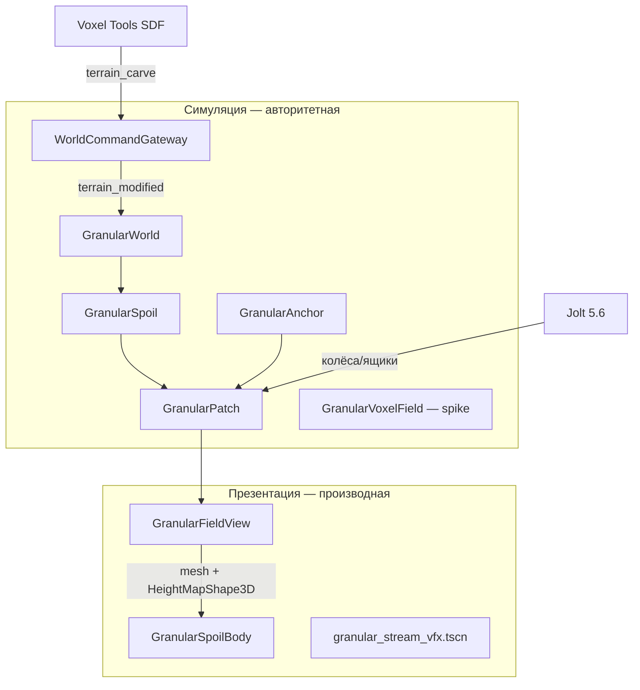

# Granular Research Synthesis — стратегический документ

Статус: синтез исследований (10 направлений + дополнения), июль 2026.  
Стек: **Godot 4.8**, **Jolt 5.6**, **Voxel Tools 1.6x**.  
Контракт реализации: [`GRANULAR-V0.md`](GRANULAR-V0.md).

> Этот документ объединяет исследования по Jolt, кодовой базе Regolith, UE5/Unity,
> академическим методам (DEM/SPH/MPM), Godot-экосистеме (granular + fluids),
> indie/AAA играм и актуальным версиям движка. Цель — одна actionable картина
> «что возможно, что нет, куда идти».

---

## 1. Executive summary

### Главный вывод

**Ни один mainstream game physics engine (Jolt, Chaos, PhysX, GodotPhysics) не делает
настоящий гранулярный реголит в realtime на масштабе open world.** Это не слабость
Godot — это industry reality. Production-игры решают задачу **разделением слоёв истины**:

```
[Gameplay truth]   SDF / heightfield / voxel grid  — объём, коллизия, persistence
[Physics coupling] Jolt rigid + heightfield contact — rover, ящики, обломки
[Presentation]     VFX, grit mesh, decals, shaders — «живость» без физической истины
```

Regolith уже выбрал **правильную архитектуру** (`GranularPatch` + Voxel SDF + Jolt).
Проблема не в «отсутствии DEM», а в **интеграции volume-модели с планетоидным voxel
sandbox** — height-field патч провалился на сфере, pivot на `GranularVoxelField` уже начат.

### Что возможно в Godot 4.8 + Jolt 5.6 + Voxel Tools

| Возможность | Реалистичность | Комментарий |
|---|---|---|
| Voxel-копка скалы (SDF, туннели, overhangs) | ✅ Да | Voxel Tools — core stack проекта |
| Отвал / осыпь с углом естественного откоса | ✅ Да | `GranularPatch` или `GranularVoxelField` |
| Сохранение объёма при dig → spoil | ✅ Да | Уже в контракте `GRANULAR-V0` |
| Усадка под rover/ящиком (Bekker-like) | ✅ Да | `settle_load`, `imprint_disc` |
| Детерминизм для коопа/replay | ✅ Да | CA без RNG — сильная сторона Regolith |
| Коллизия кучи с Jolt (HeightMapShape3D) | ✅ Да | Статический heightfield на патч |
| Десятки rigid debris/chunks | ✅ Да | Jolt: ~1000 тел @ 60 fps, sleep + no inter-debris |
| VFX пыль/струя при бурении | ✅ Да | GPUParticles3D, declarative `.tscn` |
| Следы колёс (visual + partial collision) | ✅ Да | MudRunner-паттерн: RT/shader + heightfield edit |
| Локальная вода/пропеллент (hero zone) | ⚠️ Ограниченно | GPU SPH или droplet+Jolt, <3–32k частиц |
| 3D voxel CA для рыхлого слоя | ⚠️ R&D | Spike есть; bench ~4 ms/sweep на 96³ @ 0.25 м |

### Что невозможно или нецелесообразно

| Невозможно / антипаттерн | Почему |
|---|---|
| **DEM в runtime** на km-scale sandbox | Chrono: RTF 100–14000×; 10⁶+ зёрен offline |
| **MPM sand** как основной слой мира | 55k @ 60 fps = 4×V100; consumer ~5–20k hero only |
| **Тысячи RigidBody3D «зёрен»** | Нет angle of repose; ~10k @ ~19 fps; не volume truth |
| **SoftBody3D для реголита** | XPBD mesh ≠ сыпучесть; нестабильно, дорого |
| **GPUParticles3D как gameplay truth** | Изолированы от PhysicsServer/Jolt; cap 32 colliders |
| **Noita-scale 3D CA** | Отдельный simulation tier; months of engine work |
| **Full Teardown debris pipeline** | Custom C++ engine; raymarch + voxel collision |
| **Rapier+Salva fluids + Jolt rigid** | Два physics engine; Salva без Jolt backend |
| **SnowRunner-grade mud на km²** | Proprietary CPU/GPU decoupling; Saber custom engine |
| **Единый SDF для скалы и рыхлого** | SDF хранит distance, не mass — эрозия вместо переноса |

### Стратегическая формула Regolith

**Astroneer-style SDF crust + MudRunner-style granular layer + Minecraft-style
occasional column collapse** — не Noita-in-3D и не Teardown-at-scale.

---

## 2. Сравнение методов симуляции

### 2.1. Сводная таблица

| Критерий | **Heightfield / thickness** | **3D Voxel CA** | **2D Falling Sand CA** | **DEM** | **SPH** | **MPM** | **Rigid grains (Jolt)** |
|---|---|---|---|---|---|---|---|
| **Модель** | 2.5D поле толщины | 3D сетка fill fraction | Пиксельные правила | Контакты зёрен | Сглаженные частицы жидкости | Elastoplastic continuum | Сферы/box colliders |
| **Angle of repose** | ✅ Явный (relax) | ✅ Fall+spread | ✅ Emergent | ✅ Из трения | ❌ | ✅ Drucker-Prager | ❌ |
| **Volume conserve** | ✅ Точный | ✅ Да | ✅ Да | ✅ Да | ⚠️ Приближённый | ✅ Да | ❌ |
| **Overhangs / 3D flow** | ❌ Single-valued | ✅ Да | ❌ 2D | ✅ Да | ✅ Да | ✅ Да | ✅ Per body |
| **Coupling с Jolt** | ✅ HeightMapShape3D | ⚠️ Voxel collider | ❌ | ❌ External | ❌ GPU only | ❌ GPU only | ✅ Native |
| **Planetoid / сфера** | ⚠️ Anchor OK, seams bad | ✅ Chunk-local gravity | ❌ | ❌ | ❌ | ❌ | ⚠️ |
| **Детерминизм коопа** | ✅ Да | ✅ Да | ✅ Да | ⚠️ Сложно | ❌ | ❌ | ❌ |
| **CPU budget (typ.)** | ~ms на патч | ~4 ms/sweep (96³) | ~ms–10 ms | Offline | High GPU | Very high GPU | High @ >1k |
| **Real-time consumer** | ✅ 10⁵–10⁶ cells | ⚠️ 10⁵–10⁶ cells | ✅ 512²–2048² px | ❌ 10⁴ max | ⚠️ 10⁴–10⁵ | ❌ 5–20k hero | ⚠️ 10²–10³ |
| **Regolith fit** | ✅ `GranularPatch` | ✅ Pivot path | ❌ Wrong dim | ❌ Offline calib | ❌ Fluids only | ❌ VFX tier | ⚠️ Debris only |

### 2.2. Когда какой метод

| Задача | Рекомендуемый метод | Regolith |
|---|---|---|
| Скальная порода, бур, туннели | Voxel SDF | ✅ Voxel Tools |
| Отвал, конус, осыпь на поверхности | Heightfield relax | ✅ `GranularPatch` (playground) |
| Шахта, undermining, cave-in | 3D voxel CA | 🔄 `GranularVoxelField` (spike) |
| Пыль, струя, grit | VFX / MultiMesh | ✅ presentation layer |
| Камни, обломки (10–50 шт.) | Jolt RigidBody3D | ⚠️ optional |
| Калибровка repose/sinkage | Offline DEM (Chrono) | ❌ future validation |
| Локальная вода в ISRU | GPU SPH / bulk graph | ❌ out of granular scope |

### 2.3. Гибриды (industry best practice)

```
Open world (km scale)
├── Heightfield/thickness patches — bulk truth
├── Voxel SDF — rock truth
└── Local hero zone (optional, ~10 m)
    ├── PBD grains OR MPM OR DEM offline bake
    └── Presentation: VFX particles (не truth)
```

**DEM + heightfield (BCRE):** активные частицы на поверхности, статика в heightfield —
8–30% частиц vs чистый DEM (Zhu & Yang 2010).

---

## 3. Что делают AAA и indie игры

### 3.1. По категориям техник

#### Voxel destruction + debris

| Игра | Техника | Real vs Fake |
|---|---|---|
| **Teardown** | Custom engine: voxel volumes, raymarch render, CPU voxel collision; flood-fill → rigid chunks | **Real:** разрушение, обломки. **Fake:** земля неразрушаема, вода не voxels |
| **Medieval/Space Engineers** | Grid blocks + structural integrity graph + Havok | **Real:** collapse зданий. **Fake:** voxel terrain без granular spoil |
| **Besiege** | Spring joints между блоками | Не terrain; не regolith |

#### Particle / cellular sand

| Игра | Техника | Real vs Fake |
|---|---|---|
| **Noita** | 2D falling sand CA; 512² chunks; checkerboard 4-pass threading; rigid = marching squares → Box2D | **Real:** химия, chain reactions. **Fake:** не 3D; rigid — оболочка над CA |
| **Powder Toy / WorldBox** | Particle grid + local rules | Rule-based, не continuum mechanics |
| **Sandspiel** | Web 2D CA | Эталон «feel», не 3D |

#### Block voxels + falling blocks

| Игра | Техника | Real vs Fake |
|---|---|---|
| **Minecraft** | `FallingBlockEntity` при потере опоры | **Fake:** нет angle of repose, нет pile |
| **Minetest** | `falling_node` entity, flood scan | То же |
| **Veloren** | Block voxels + greedy meshing; fluid mesh отдельно | Dig = remesh; нет spoil heap |

#### SDF / density voxels (smooth dig)

| Игра | Техника | Real vs Fake |
|---|---|---|
| **Astroneer** | 3D density + Marching Cubes; dirty chunk remesh | **Real:** smooth tunnels. **Fake:** выкопанное исчезает / в inventory |
| **Enshrouded** | Proprietary full voxel; negative stamps | Granular flow не заявлен |
| **Space Engineers** | Voxel boolean cut | Cut ≠ regolith pile |
| **7 Days to Die** | Voxel + isosurface mesh | Heightmap gen + runtime edit |
| **Scrap Mechanic** | Density + material voxels | Convex hull edits |
| **Satisfactory / TerraTech** | Static mesh / scenery damage | **Нет terrain digging** |

#### Heightfield mud / tire tracks

| Игра | Техника | Real vs Fake |
|---|---|---|
| **MudRunner / Spintires / SnowRunner** | 16×16 m blocks; **CPU physics ≠ GPU render**; RT stamps (25×25 + 128×128); empirical traction | **Impressive:** tracks, sink, slide. **Fake:** «very vague connection to real physics» (lead dev) |
| **Valheim** | Heightmap modifiers, ±8 m | 2.5D; нет пещер |
| **SnowRunner** | Saber proprietary engine (не UE!) | Viscosity masks, extrusion data |

#### Sediment / water

| Игра | Техника | Real vs Fake |
|---|---|---|
| **Hydroneer** | UE4 voxel dig + pressure arithmetic | **Fake:** «sediment» = dirty water stat, не terrain |
| **Planet Coaster 2** | Shallow water 2D heightfield | Не SPH; ripples на бассейнах |

#### Lunar / Mars rover sims

| Проект | Техника |
|---|---|
| **LunCo, LUMINSim** | Godot rovers/mission; solver physics, не granular CA |
| **Research (arxiv 2024–26)** | Offline DEM → regression sinkage → runtime heightmap pixel edit |
| **Chrono DEM-Engine** | GPU DEM, GRC-1 lunar simulant, RASSOR digging — **не realtime game** |
| **Isaac Sim** | Granular soil не в roadmap |

### 3.2. Универсальный паттерн индустрии

```
Truth layer (cheap, deterministic)     +     Fake layer (expensive, visual)
─────────────────────────────────────       ────────────────────────────────
SDF / heightfield / block grid                Shaders, decals, particles
Volume conservation                           Regression traction formulas
Host-authoritative state                      GPU RT displacement
```

**Regolith = Hydroneer dig philosophy + MudRunner pile philosophy**, без budget AAA.

---

## 4. Текущее состояние Regolith и пробелы

### 4.1. Архитектура (sim vs presentation)



| Слой | Файлы | Статус |
|---|---|---|
| **GranularPatch** | `scripts/simulation/runtime/granular_patch.gd` (~760 строк) | ✅ Зрелое ядро: repose, гистерезис, bearing, spill, settle |
| **GranularAnchor** | `granular_anchor.gd` | ✅ Radial up на планетоиде |
| **GranularSpoil** | `granular_spoil.gd` | ✅ deposit_ring/heap; SWELL=1.0, VISIBLE=0.5 |
| **GranularWorld** | `granular_world.gd` | ⚠️ **enabled=false** в `main.tscn` |
| **GranularVoxelField** | `granular_voxel_field.gd` | 🔄 Spike; bench 96³ @ 0.25 м |
| **Presentation** | `granular_field_view.gd`, `granular_spoil_body.gd` | ✅ Mesh + HeightMapShape3D |
| **Tests** | `test_granular_patch.gd` — 30 тестов | ✅ В `run_tests.sh` |
| **Demos** | `granular_playground`, `granular_cascade`, `bench_granular_voxel_ca` | ✅ Eye verification |

### 4.2. Почему height-field интеграция остановлена

Документировано в `granular_world.gd`:

- Seam с Transvoxel на планетоиде
- Невозможность стен/тоннелей (single-valued height)
- Overlapping patches без общей истины
- «Висящие» кучи при undermining с соседнего патча

**Вывод:** height-field **работает в playground**, но **не масштабируется** на
открытый voxel sandbox на сфере. Pivot → **volume CA + Voxel Tools meshing**.

### 4.3. Пробелы vs state of the art

| Область | Regolith v0 | Gap |
|---|---|---|
| **Геометрия рыхлого** | Height-field (ограничение) | → `GranularVoxelField` + второй VoxelTerrain |
| **Интеграция с terrain** | Отключена | Chunk streaming, без HeightMap seam |
| **Массовый баланс dig** | 50% visible, swell=1 | Bulking 10–25%, haul-away loop |
| **Terramechanics** | Linear p–z, repose | Wheel sinkage, bulldozing rim, rut formation |
| **Undermining / cave-in** | Частично (base resample) | mobilize + spill между chunks |
| **Персистентность** | Нет | Chunk mass в moon save |
| **PHYSICAL-LANGUAGE.md** | Нет § Granular | Контрактный gap с § Impact Destruction |
| **VFX** | Stream + mesh grain | Low-g dust hang time, flowing_volume hook |
| **Фракции** | Один density_scale | Fines/blocky, сегрегация |

### 4.4. Уникальность Regolith в экосистеме

В Godot **нет** зрелого open-source lunar regolith с mass-conserving spoil.
Regolith уникален попыткой **детерминированного CA + planetoid anchor**.
Ближайшие референсы: **n3d2** (Bevy, 0.25 m voxels, sand CA), **Chrono DEM**
(research), **LunCo/LUMINSim** (rovers, не отвал).

---

## 5. Реалистичные tier'ы «great» granular simulation

### Tier A — «Правильно работает в основном мире» (must-have)

**Цель:** dig → spoil → pile → rover interaction на планетоиде без seam-багов.

| Критерий успеха | Метрика |
|---|---|
| Бур создаёт видимую кучу у устья | deposit_ring, не sheet в шпур |
| Куча имеет конус ~33° | visual + test angle |
| Rover едет по куче, слегка проваливается | settle_load readable |
| Копка под кучей роняет её | base resample / voxel take |
| Нет seam с Transvoxel | volume layer через Voxel Tools |
| Headless-тесты зелёные | `test_granular_patch` + voxel CA gate |

**Техника:** `GranularVoxelField` → второй VoxelLodTerrain / density channel →
dig pipeline через `WorldCommandGateway`.

### Tier B — «Ощущается живым» (game feel)

**Цель:** игрок *чувствует* реголит, не только видит конус.

| Критерий успеха |
|---|
| SWELL_FACTOR > 1, tune VISIBLE_FRACTION |
| Haul-away: scoop → rover bed / processor |
| Wheel tracks на spoil (visual RT + partial collision) |
| Dust plume при carve (GPUParticles + low-g hang) |
| Mobilize → лавина при резком ударе / undermining |
| Material presets: mare vs highland → разный repose/density |

### Tier C — «Production polish» (shipping quality)

**Цель:** persistence, контракт, баланс, кооп.

| Критерий успеха |
|---|
| Chunk mass в moon save (SQLite digs расширить) |
| § Granular/Spoil в PHYSICAL-LANGUAGE.md |
| Spill routing между chunks автоматически |
| Sanity bounds vs Apollo/Surveyor (regression test) |
| Performance gate: bench voxel CA в CI |
| Edge spill → cascade между соседними chunks |

### Tier D — «Research tier» (опционально, не v1)

**Цель:** validation и hero moments, не core loop.

| Критерий |
|---|
| Offline Chrono DEM для калибровки repose/sinkage curves |
| Hybrid: coarse voxel CA + decorative DEM particles на surface |
| Local GPU SPH для ISRU water/propellant demo |
| Rare rigid clumps (10–50) при крупном avalanche |

**Tier D не блокирует A–C.** Это R&D поверх working core.

---

## 6. Roadmap с приоритетами

### P0 — Критический pivot (блокирует «great»)

| # | Задача | Обоснование | Effort |
|---|---|---|---|
| 1 | **Довести `GranularVoxelField` до parity с `GranularPatch`** | Гистерезис, mobilize, bearing/settle, radial down из GravityField | High |
| 2 | **Chunking** (8–16 m, LRU как у патчей) | Planetoid scale | Med |
| 3 | **Второй VoxelTerrain / density channel** | Без HeightMap seam; общий collider через Voxel Tools | High |
| 4 | **Переподключить dig→spoil на volume path** | `terrain_modified` → deposit в voxel chunk at mouth | Med |
| 5 | **CI gate для voxel CA** | `bench_granular_voxel_ca` → порог ms/sweep | Low |
| 6 | **Включить в `main.tscn` после visual QA** | Только когда seam/overhang/cave-in OK | — |

### P1 — Game feel (после P0)

| # | Задача | Effort |
|---|---|---|
| 7 | Калибровка массы: SWELL_FACTOR, VISIBLE_FRACTION, `TERRAIN-MATERIALS-V1` | Low |
| 8 | Haul-away loop (scoop → bed → processor) | Med |
| 9 | Wheel–soil: sinkage + bulldozing rim из voxel density / surface_height | Med |
| 10 | Undermining test: «копка под кучей роняет её» на volume path | Low |
| 11 | VFX: dust plume, `flowing_volume_m3` hook | Low |

### P2 — Контракт и polish

| # | Задача | Effort |
|---|---|---|
| 12 | PHYSICAL-LANGUAGE.md: § Granular/Spoil + согласование с Impact Destruction | Low |
| 13 | Персистентность chunk mass в moon save | Med |
| 14 | Material presets в `moon_terrain_params` / balance JSON | Low |
| 15 | Apollo/Surveyor sanity regression test | Low |

### P3 — Visual polish (параллельно P1–P2)

| # | Задача | Источник идеи | Effort |
|---|---|---|---|
| 16 | Wheel track RT + shader displacement (MudRunner) | Low–Med |
| 17 | SubViewport mask для следов на spoil heap | Low |
| 18 | Rare rigid clumps при avalanche (10–50, sleep, no inter-collision) | Med |

### P4 — Не начинать до закрытия P0

| # | Задача | Почему отложено |
|---|---|---|
| 19 | Runtime DEM/MPM | Offline validation only |
| 20 | GPU SPH global fluid | Out of granular scope; niche ISRU |
| 21 | Full Noita 3D CA | Wrong product tier |
| 22 | Rapier+Salva migration | Ломает Jolt + invariants |

### Timeline (ориентир для малой команды)

```
Q1–Q2   P0: GranularVoxelField + VoxelTerrain integration + dig pipeline
Q2–Q3   P1: mass balance, wheel coupling, VFX
Q3–Q4   P2: persist, contract, regression
Parallel P3 visual polish; P4 only if research budget appears
```

---

## 7. Библиография и ключевые ресурсы

### Regolith (внутренние)

| Документ | URL |
|---|---|
| Granular v0 spec | [`docs/specs/GRANULAR-V0.md`](GRANULAR-V0.md) |
| Terrain materials | [`docs/specs/TERRAIN-MATERIALS-V1.md`](TERRAIN-MATERIALS-V1.md) |
| Voxel Tools cheatsheet | [`docs/cheatsheets/voxel-tools.md`](../cheatsheets/voxel-tools.md) |
| AGENTS.md (верификация) | [`AGENTS.md`](../../AGENTS.md) |

### Godot 4.8 + Jolt 5.6

| Ресурс | URL |
|---|---|
| Using Jolt Physics | https://docs.godotengine.org/en/stable/tutorials/physics/using_jolt_physics.html |
| SoftBody3D | https://docs.godotengine.org/en/stable/tutorials/physics/soft_body.html |
| GPUParticles3D collision | https://docs.godotengine.org/en/stable/tutorials/3d/particles/collision.html |
| Compute shaders | https://docs.godotengine.org/en/stable/tutorials/shaders/compute_shaders.html |
| JoltPhysics library | https://jrouwe.github.io/JoltPhysics/ |
| Jolt multicore scaling | https://jrouwe.nl/jolt/JoltPhysicsMulticoreScaling.pdf |
| Fluid simulation proposal #2094 | https://github.com/godotengine/godot-proposals/issues/2094 |

### Voxel Tools

| Ресурс | URL |
|---|---|
| godot_voxel | https://github.com/Zylann/godot_voxel |
| Voxel Tools docs | https://voxel-tools.readthedocs.io/en/latest/overview/ |
| solar_system_demo | https://github.com/Zylann/solar_system_demo |

### Академические методы

| Работа | Метод | URL |
|---|---|---|
| Klár et al. — MPM sand | MPM | https://doi.org/10.1145/2897824.2925906 |
| Hu et al. — MLS-MPM | MPM | https://github.com/yuanming-hu/taichi_mpm |
| Macklin — Unified PBD | PBD granular | https://mmacklin.com/uppfrta_preprint.pdf |
| Zhu & Yang — sand surface flow | DEM + heightfield | https://www.cs.dartmouth.edu/~bozhu/papers/sand_surface_flow.pdf |
| Real-time heightfield sand+water | 2.5D | https://doi.org/10.1145/3610548.3618159 |
| Chrono DEM-Engine extraterrestrial | DEM | https://arxiv.org/abs/2311.04648 |
| Chrono CRM lunar sensor | CRM/SPH | https://arxiv.org/abs/2410.04371 |
| GranularGym | Realtime DEM + rigid | https://github.com/dmillard/GranularGym |

### Игры — postmortem / technical

| Тема | URL |
|---|---|
| Teardown GDC / design | https://blog.voxagon.se/2020/11/05/teardown-design-notes.html |
| Teardown multiplayer (2026) | https://80.lv/articles/teardown-developer-breaks-down-multiplayer-and-voxel-destruction-tech/ |
| Noita GDC 2019 | https://www.youtube.com/watch?v=prXuyMCgbTc |
| Noita 80.lv | https://80.lv/articles/noita-a-game-based-on-falling-sand-simulation |
| MudRunner mud (lead dev) | https://www.gamedeveloper.com/programming/mud-and-water-of-spintires-mudrunner |
| Astroneer postmortem | https://www.gamedeveloper.com/design/what-i-astroneer-i-s-devs-learned-while-leaving-early-access |
| No Man's Sky GDC | https://www.youtube.com/watch?v=C9RyEiEzMiU |
| Planet Coaster 2 water | https://www.gamedeveloper.com/programming/deep-dive-crafting-detailed-and-dynamic-water-in-planet-coaster-2 |

### Godot ecosystem (granular / sand / fluid)

| Проект | URL |
|---|---|
| neon-sand (GDExtension CA) | https://github.com/KunkelAlexander/neon-sand |
| sand-slide | https://github.com/kiwijuice56/sand-slide |
| godot-fluid-sim (droplet+Jolt) | https://github.com/thompsop1sou/godot-fluid-sim |
| Godot 3D SPH (deni10000) | https://github.com/deni10000/Godot-3D-SPH-Fluid-Simulation |
| godot-rapier-physics + Salva | https://github.com/appsinacup/godot-rapier-physics |
| n3d2 (Bevy sand CA ref) | https://github.com/dfayd0/n3d2 |
| LunCo | https://github.com/LunCoSim/lunco-sim-godot |
| Chrono + DEM-Engine | https://github.com/projectchrono/DEM-Engine |

### UE5 / Unity (transferable patterns)

| Ресурс | URL |
|---|---|
| Niagara Simulation Stages | https://www.strayspark.studio/blog/niagara-vfx-advanced-simulation-stages |
| Virtual Heightfield Mesh | https://dev.epicgames.com/community/learning/tutorials/ZZzk/unreal-engine-implementing-a-landscape-with-a-virtual-heightfield-mesh |
| keijiro StableFluids (Unity→Godot port ref) | https://github.com/keijiro/StableFluids |
| Spintires mud breakdown | https://80.lv/articles/breakdown-mud-and-water-of-spintires |

---

## 8. Anti-patterns — чего НЕ делать

### 8.1. Физика и симуляция

| Anti-pattern | Почему плохо | Альтернатива |
|---|---|---|
| **Тысячи RigidBody3D как «песок»** | Нет repose; ~10k @ 19 fps; не volume truth | Heightfield / voxel CA |
| **SoftBody3D для реголита** | Wrong material model; нестабильно | `GranularPatch` / voxel CA |
| **GPUParticles3D как истина объёма** | Не PhysicsServer; cap 32 colliders | VFX only |
| **Runtime DEM/MPM как core loop** | RTF 100×+; не consumer GPU | Offline Chrono calib |
| **SDF relax для рыхлого** | Distance ≠ mass; эрозия | Отдельный thickness layer |
| **Per-nugget PhysX (Hydroneer)** | FPS collapse @ 10k+ bodies | Aggregate state |
| **Rapier+Salva вместо Jolt** | Два engine; Salva без Jolt | Bulk graph + VFX для fluid |
| **Full Noita 3D CA** | Months engine work; не planetoid | Volume CA + Voxel Tools |

### 8.2. Архитектура и интеграция

| Anti-pattern | Почему плохо | Альтернатива |
|---|---|---|
| **Дорабатывать height-field `GranularWorld` на планетоиде** | Уже провалилось (seam, overhang) | `GranularVoxelField` pivot |
| **Global heightmap на сфере** | Физически бессмысленно | Local patches / voxel chunks |
| **Смешивать fluid solver с granular truth** | Разные домены; lunar regolith ≠ Newtonian fluid | Separate specs |
| **Presentation grains влияют на volume** | Non-deterministic; coop break | Grit/VFX декоративно |
| **Ждать DEM в Jolt 5.6** | Нет в roadmap; game-oriented engine | Custom CA layer |

### 8.3. Scope и процесс

| Anti-pattern | Почему плохо |
|---|---|
| **Headless test для «feel» сыпучести** | AGENTS.md R2: gameplay — в игре |
| **VisualShader для granular** | AGENTS.md R3: только `.gdshader` text |
| **Новый machine type без спеки** | AGENTS.md R1 |
| **Terrain3D / HTerrain поверх Voxel Tools** | Конфликт со сферой и Transvoxel |
| **Falling sand GDExtension (2D) как core** | Wrong dimension; второй мир |

### 8.4. «Fake» techniques — когда это OK

Не всё «fake» — плохо. Industry standard:

| Fake technique | Когда OK |
|---|---|
| Shader displacement tracks | Visual only; MudRunner pattern |
| GPUParticles dust | Bur stream, avalanche VFX |
| Regression sinkage formulas | Wheel traction без DEM |
| Decals / RT footprints | Readability > physics accuracy |
| SWELL_FACTOR as constant | Until haul-away loop exists |

**Правило:** fake layer **не мутирует truth layer** без явного моста
(settle_load, deposit, take — мосты; VFX — не мост).

---

## 9. Decision matrix (быстрый выбор)

| Вопрос | Ответ для Regolith |
|---|---|
| Нужен ли DEM в runtime? | **Нет.** Offline validation only. |
| Heightfield или voxel CA? | **Voxel CA** для main world; heightfield OK в playground |
| Jolt для зёрен? | **Нет.** Jolt для rover, tools, debris (десятки тел) |
| SPH для реголита? | **Нет.** Granular ≠ fluid. Bulk graph для ISRU water later. |
| GPU compute relax? | **P3**, после volume integration |
| Что делать первым? | **P0:** `GranularVoxelField` + VoxelTerrain + dig pipeline |
| Как измерить «great»? | Tier A checklist + human in-game confirmation |
| Как не over-engineer? | Не начинать P4 до закрытия P0 |

---

## 10. Заключение

Regolith стоит на **фундаменте, который совпадает с industry best practice**:
разделение SDF (скала) и granular layer (рыхлое), Jolt 5.6 для rigid coupling,
presentation отдельно от truth. Это не компромисс из-за слабости Godot — это
**единственный реалистичный путь** для lunar sandbox малой команды.

**Главный стратегический шаг:** завершить pivot с height-field патча на
**`GranularVoxelField` + Voxel Tools**, перенося физические правила из
`GranularPatch` (repose, mobilize, bearing, spill), а не чинить seam'ы
отключённого `GranularWorld`.

**Главный anti-pattern:** гнаться за DEM/MPM/Noita-in-3D вместо volume
integration, mass balance и wheel coupling — это съест год без shipping value.

---

*Синтез: 10 research reports (Jolt, Regolith codebase, UE5, Godot granular,
academic DEM/SPH/MPM, Unity, indie games, Godot fluids, Voxel Tools, middleware)
+ version audit (Godot 4.8, Jolt 5.6).*

---

## Voxel Tools (дополнение)

Дата: 2026-07-20. Контекст: Regolith на **Voxel Tools 1.6x** (`addons/zylann.voxel/`) —
VoxelLodTerrain + Transvoxel SDF, Jolt mesh colliders, VoxelStreamSQLite.
Loose regolith (GranularPatch, GranularSpoil, GranularVoxelField) — **overlay проекта**, не API плагина.

### Что плагин даёт vs не даёт

| Область | Voxel Tools | Regolith overlay |
|---|---|---|
| Runtime SDF dig/add (do_sphere, do_path) | ✅ | Volume accounting → spoil |
| Streaming + persistence modified blocks | ✅ | Отдельный digs SQLite |
| LOD planet-scale crust | ✅ | Moon generator graph |
| Mesh physics colliders (Jolt) | ✅ | Aim raycast, spawn settle |
| **Granular heaps / angle of repose** | ❌ | GranularPatch / voxel CA |
| **Auto debris при do_sphere** | ❌ | GranularSpoil deposit |
| Sand/water как loose phase | ❌ | Не в roadmap Zylann |

Официальная позиция: модуль — editable voxel **substrate**, не universal soil simulator.
→ [Документация](https://voxel-tools.readthedocs.io/en/latest/) · [GitHub](https://github.com/Zylann/godot_voxel)

### Dig/colliders/debris — практика

**Копание (smooth SDF):** VoxelTool через terrain.get_voxel_tool() —
CHANNEL_SDF, MODE_REMOVE, do_sphere(local_center, radius) (local space terrain).
Альтернативы: do_path (бур), do_box, copy/paste. Редактируются только **loaded LOD 0**
(is_area_editable); distant blocks не трогаются ([#316](https://github.com/Zylann/godot_voxel/issues/316)).

**Colliders:** generate_collisions + **VoxelViewer** обязателен; concave mesh per chunk,
создание ~3–5× дороже meshing. С Jolt: tunnelling, lag collider vs SDF после edit
([#676](https://github.com/Zylann/godot_voxel/issues/676), [#677](https://github.com/Zylann/godot_voxel/issues/677)) —
Regolith: physics raycast для aim, SDF для edit, bootstrap.gd settle gate.

**Debris (не spoil):** separate_floating_chunks(box, parent) на **VoxelToolLodTerrain**
отрезает **висящие SDF-острова** → RigidBody3D + convex collider (box ~30 voxels max).
Подходит для «обломков скалы», не для regolith heap. Regolith: TerrainFloatingDebrisService.
WIP branch floating_chunks ([#640](https://github.com/Zylann/godot_voxel/issues/640)).

**do_sphere MODE_ADD** может «насыпать» solid SDF — это **скала**, не loose granular.

### Issue #647 и community workarounds

[#647](https://github.com/Zylann/godot_voxel/issues/647): sand/water как **отдельный negated VoxelTerrain**
— community hack, не фича модуля; Zylann не планирует «закрытие срезов» mesh для loose material.
Terabase Voxel-Destruction — .vox props + debris modes, **не** planet terrain
([Asset Library #3743](https://godotengine.org/asset-library/asset/3743)).

**Правильный Regolith-путь:** SDF carve → volume → GranularSpoil → deposit на
GranularPatch / GranularVoxelField (см. docs/specs/GRANULAR-V0.md, docs/cheatsheets/voxel-tools.md).

### Сводка TODAY vs NOT planned

| ✅ Сегодня (1.6x) | 🔴 Не planned |
|---|---|
| SDF + Transvoxel + SQLite persistence | Granular/spoil physics |
| Runtime dig/add, instancer props | Auto terrain debris on dig |
| Jolt mesh colliders | Loose layer в voxel grid |
| separate_floating_chunks rigid islands | Dual-phase solid+loose в одной сетке |

**Архитектурный вывод:** Voxel Tools = **solid substrate**; lunar regolith = **simulation overlay** —
aligned с intent автора и текущим кодом Regolith.

### Ключевые ссылки

| Ресурс | URL |
|---|---|
| VoxelTool API | https://voxel-tools.readthedocs.io/en/latest/api/VoxelTool/ |
| Smooth terrain | https://voxel-tools.readthedocs.io/en/latest/smooth_terrain/ |
| Performance / Physics | https://voxel-tools.readthedocs.io/en/latest/performance/ |
| Feature branches #640 | https://github.com/Zylann/godot_voxel/issues/640 |
| Regolith cheatsheet | docs/cheatsheets/voxel-tools.md |


## Middleware (дополнение)

Дата: 2026-07-20. Фокус: **доступность для indie-разработчика на Godot** — лицензия,
готовый GDExtension, кроссплатформенность, зрелость API для granular (не только
«красивая вода»).

### Сводная таблица

| Middleware | Статус (2025–26) | Granular / fluid | Godot GDExtension | Стоимость (indie) | Игры / применение |
|---|---|---|---|---|---|
| **NVIDIA FleX** | Legacy, unsupported | Unified PBD: fluid, cloth, soft, granular, phase transitions | Нет; CUDA-only; WIP `beiller/godot_physx` не про FleX | Бесплатно (legacy download) | Killing Floor 2, Fallout 4 (patch 1.3 debris), NVIDIA VR Funhouse, TouchDesigner |
| **NVIDIA Flow** | Активен; open source (apr 2025) | Sparse voxel **gas** (дым/огонь), не liquid/granular | Нет; HLSL/DX11–12, интеграция с нуля | BSD-3, бесплатно | Omniverse/Isaac Sim VFX; не игровой runtime |
| **NVIDIA PhysX 5.6** | Активен; GPU code open source (apr 2025) | PBD particles: fluid, **granular (sand)**, cloth; FEM soft body; Flow smoke | Нет официального; `beiller/godot_physx` — эксперимент; нужен custom PhysicsServer | BSD-3, бесплатно | Omniverse, Isaac Sim, O3DE; legacy: Borderlands 2, Mirror's Edge (rigid); particles — сим-стек NVIDIA |
| **Havok Physics** | Активен (Microsoft) | Havok Particles: lightweight fluid/VFX/destruction, не continuum granular | SDK «any engine», но **нет Godot-биндинга**; интеграция = months | **$50k/product** (budget ≤$20M); не indie | Helldivers 2, Elden Ring (nav), Destiny 2 (cloth), Halo, Skyrim (legacy) |
| **Bullet 3** | Поддерживается; soft body PBD + deformable CG | Soft body/cloth; granular только DIY (нет native sand) | Был в Godot 3; **удалён из Godot 4**; GDExtension с нуля | zlib, бесплатно | GTA, Red Dead (частично), research/DEM; Godot — исторический backend |
| **OpenVDB** | Активен (ASWF); Apache 2.0 | **Хранение/CSG** sparse volumes; не real-time granular solver | Нет native import; community: VDB→Texture3D + raymarch; GDExtension возможен | Бесплатно | Feature film (DreamWorks); в играх — baked VDB / ZibraVDB, не симуляция |
| **Taichi Lang** | Активен; Apache 2.0 | MPM (sand/snow/water), SPH; research-grade | Нет Godot plugin; Unity C-API (Vulkan only); GDExtension = Taichi AOT + compute bridge | Бесплатно | taichi_elements demos; Unity Taichi-UnityExample; Blender addon (experimental) |
| **Zibra Effects** | Активен | Real-time liquid/smoke/fire (SDF colliders); **не regolith/granular bulk** | **Только UE + Unity** | Indie **$120** lifetime (rev ≤$100k); ZibraVDB free (≤$100k) | Echoes of Somewhere, Hydrolab (AR); marketing cites AC/Subnautica как genre refs |
| **PositionBasedDynamics** | Активен; MIT | PBD fluids + rigid; granular через friction model (Macklin et al.) | Нет; C++ lib → custom GDExtension | Бесплатно | База для SPlisHSPlasH; academic real-time sand demos |
| **SPlisHSPlasH** | Активен v2.17; MIT | SPH fluid + deformable solids; не dedicated granular | Нет; offline/batch или heavy wrapper | Бесплатно | Research tool; EPA game-engine study; экспорт Partio/VTK |
| **Obi Fluid** (Unity) | Активен | PBD fluid + **Granular blueprint** (sphere particles) | Unity only | **$60** (Fluid) / $179 (Suite) | Unity indie standard для fluid/granular VFX |
| **Rapier + Salva** | Активен | **2D fluid** (Salva); 3D fluid — WIP | **Да** — Asset Library GDExtension | Бесплатно (MIT/Apache) | Godot community; не 3D regolith |
| **Godot SPH addon** | Community | 3D SPH compute (32k+ particles) | **Да** — Asset Library | MIT | Демо/VFX; не gameplay granular bulk |
| **Jolt** (встроен в Godot 4.4+) | Default 3D physics | Rigid + heightfield; **нет** granular/fluid | Встроен (не GDExtension) | Бесплатно | Godot 4.6 default; Regolith использует для коллизий |

### Детали по ключевым кандидатам

#### NVIDIA FleX

- **Статус:** официально legacy ([NVIDIA Developer](https://developer.nvidia.com/flex-example)); download as-is, без поддержки. Функциональность частично перешла в PhysX PBD, но **не 1:1** ([PhysX Discussion #129](https://github.com/NVIDIA-Omniverse/PhysX/discussions/129)).
- **Granular:** unified particle solver — один из немногих с phase transitions (fluid↔solid); CUDA-only → плохая кроссплатформенность для shipping.
- **Godot:** нецелесообразен для indie Godot в 2026: мёртвая поддержка, NVIDIA-only, нет готового моста.
- **Вердикт для Regolith:** ❌ архивный интерес, не production path.

#### NVIDIA Flow

- **Статус:** активная разработка в репозитории [NVIDIA-Omniverse/PhysX](https://github.com/NVIDIA-Omniverse/PhysX); Flow 2.2 + GPU shaders open source (BSD-3, апрель 2025).
- **Granular:** **нет** — combustible **gaseous** fluids (огонь/дым), sparse voxel grid, HLSL.
- **Godot:** интеграция = порт HLSL→GLSL/Vulkan RDG + отдельный сим-цикл; months of engine work.
- **Вердикт:** ❌ для regolith; ⚠️ только если нужен in-engine fire/smoke на Vulkan.

#### NVIDIA PhysX 5.6 (+ PBD particles)

- **Статус:** активен; SDK + GPU kernels open source (BSD-3). PBD particles: fluid, **granular (sand)**, cloth; GPU-only для particles ([Omniverse docs](https://docs.omniverse.nvidia.com/extensions/latest/ext_physics/physics-particles.html)).
- **Granular:** preset materials для sand-like media; двусторонняя связь с rigid/deformable; **не** continuum/rheology (Bingham и т.п. — аппроксимация поверх PBD).
- **Godot:** Godot **не планирует** встроенный PhysX ([proposal #4044](https://github.com/godotengine/godot-proposals/discussions/4044)); единственный след — эксперимент [`beiller/godot_physx`](https://github.com/beiller/godot_physx) (заброшен). Реалистичный путь: GDExtension PhysicsServer3D **или** sidecar sim + sync transforms — оба **high effort**.
- **Стоимость:** $0; но скрытая цена — CUDA/NVIDIA GPU для particles, AMD/Intel GPU acceleration потребует форка kernels.
- **Вердикт:** ⚠️ технически лучший «готовый» granular PBD, но **плохой fit для open indie Godot** (нет plugin, NVIDIA GPU lock-in, огромный integration cost).

#### Havok

- **Статус:** активная разработка (SDK 2025.2); Microsoft. Havok Particles — fast VFX fluid/destruction, trade fidelity for speed ([havok.com](https://www.havok.com/havok-physics/)).
- **Godot:** SDK «integrates with any engine» — на практике custom C++ bridge; **zero Godot ecosystem**.
- **Стоимость:** $50 000/product (budget ≤$20M) — **не indie** ([GDC 2025](https://www.gamedeveloper.com/programming/25-years-in-havok-unveils-royalty-free-pricing-for-budgets-up-to-20-million)).
- **Вердикт:** ❌ для Regolith.

#### Bullet 3

- **Статус:** maintained; soft body (legacy PBD + newer deformable CG solver). **Нет** dedicated granular/fluid module.
- **Granular:** возможен DIY (research: DEM-like clumps); PositionBasedFluids — отдельные проекты, не в core Bullet.
- **Godot:** удалён из Godot 4; возврат = полный GDExtension physics server (как Jolt, но без community momentum).
- **Игры:** широко в AAA middleware stacks historically; в Godot — мёртвый путь.
- **Вердикт:** ❌ superseded by Jolt для rigid; не решает granular.

#### OpenVDB (+ NanoVDB)

- **Статус:** ASWF, Apache 2.0; industry standard для **offline/baked** volumetrics.
- **Granular:** формат хранения, не solver. Real-time sim через OpenVDB возможен для CSG/fields, но тяжёлый для game loop.
- **Godot:** нет importers; pipeline VDB→Texture3D→shader ([community tools](https://github.com/meowyih/godot_openvdb_texture3d)); proposal [#2516](https://github.com/godotengine/godot-proposals/issues/2516) закрыт в пользу bake.
- **Вердict:** ⚠️ для **рендера baked dust plumes**, не для dig/spoil gameplay truth.

#### Taichi Lang

- **Статус:** активен; Apache 2.0; Python DSL → CUDA/Vulkan/CPU.
- **Granular:** taichi_elements (MPM: sand, snow, water) — research demos; SPH_Taichi — million-particle SPH.
- **Godot:** **нет** GDExtension. Unity path: [Taichi-UnityExample](https://github.com/taichi-dev/Taichi-UnityExample) (Vulkan-only, experimental). Для Godot: AOT compile kernels → RenderingDevice compute — **custom R&D**.
- **Вердикт:** ⚠️ отличный **prototyping** (offline bake или sidecar), ❌ turnkey для shipped Godot game.

#### Zibra (Liquid / Smoke&Fire / VDB)

- **Статус:** активен; UE + Unity (+ Houdini для VDB).
- **Granular:** **нет** — liquids + volumetric smoke/fire; small-to-midsize interactive VFX.
- **Godot:** **нет SDK/plugin**. ZibraVDB free для indie (≤$100k) — только UE/Houdini import.
- **Стоимость:** Zibra Effects indie **$120** lifetime ([zibra.ai](https://www.zibra.ai/zibra-liquid-smoke-effects)); ZibraVDB Personal free.
- **Игры:** Echoes of Somewhere, Hydrolab; case studies, не AAA bulk regolith.
- **Вердict:** ❌ Godot; ⚠️ если команда также шипит Unity/UE build.

### Godot-native и community альтернативы (важнее middleware для indie)

| Подход | Granular fit | Effort | Примечание |
|---|---|---|---|
| **Custom heightfield patch** (`GranularPatch`) | ★★★★★ для bulk regolith | Уже в проекте | Истина = thickness map, не particles; см. `GRANULAR-V0.md` |
| **Voxel CA / cellular** (`granular_voxel_field`) | ★★★★ локальный flow | В R&D | Хорош для bench/PoC |
| **Compute SPH (Asset Library)** | ★★ VFX liquid | Low (plugin) | 32k particles, SDF collision; не lunar bulk |
| **Rapier+Salva 2D** | ★ 2D only | Low | Fluids в 2D проектах |
| **PositionBasedDynamics / SPlisHSPlasH** | ★★★ research | High (C++ GDExtension) | MIT; нет готового Godot bridge |
| **PhysX PBD** | ★★★★ capability | Very high | Open source, но NVIDIA+custom server |
| **Baked VFX (EmberGen/LiquiGen/Houdini→VDB/flipbook)** | ★ presentation | Low–medium | 200+ game studios на EmberGen; **zero gameplay coupling** |

### Рекомендация для Regolith (indie Godot)

1. **Gameplay truth для lunar regolith** — оставаться на **custom continuum** (`GranularPatch` / voxel CA), не middleware particles. Причины: determinism (R6 coop), coupling с voxel SDF crust, planetoid anchors, контроль угла repose — middleware не даёт этого из коробки.

2. **Presentation layer** — declarative VFX + optional local particle burst; baked flipbooks (EmberGen) для dust plumes; OpenVDB/ZibraVDB **не нужны** unless cinematic quality bar rises.

3. **Если нужен interactive 3D liquid** (не regolith bulk) — Godot SPH compute addon или sidecar Taichi/PhysX R&D; не FleX/Havok.

4. **Не тратить время на:** FleX (dead), Havok ($50k), Zibra/Obi (wrong engine), OpenVDB as solver.

### Источники

- [NVIDIA FleX legacy notice](https://developer.nvidia.com/flex-example)
- [PhysX SDK / open source GPU (apr 2025)](https://developer.nvidia.com/physx-sdk)
- [PhysX PBD particles docs](https://docs.omniverse.nvidia.com/extensions/latest/ext_physics/physics-particles.html)
- [Flex vs PhysX particles (#129)](https://github.com/NVIDIA-Omniverse/PhysX/discussions/129)
- [Havok pricing](https://www.havok.com/pricing/)
- [Zibra Effects pricing](https://www.zibra.ai/zibra-liquid-smoke-effects)
- [OpenVDB GitHub / Apache 2.0](https://github.com/AcademySoftwareFoundation/openvdb)
- [Taichi license](https://www.taichi-lang.org/)
- [PositionBasedDynamics](https://github.com/InteractiveComputerGraphics/PositionBasedDynamics)
- [SPlisHSPlasH](https://splishsplash.physics-simulation.org/)
- [Godot PhysX proposal #4044](https://github.com/godotengine/godot-proposals/discussions/4044)
- [Godot Rapier Physics](https://github.com/appsinacup/godot-rapier-physics)
- [Godot 3D SPH addon](https://godotengine.org/asset-library/asset/5116)
